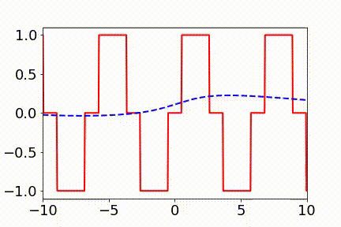
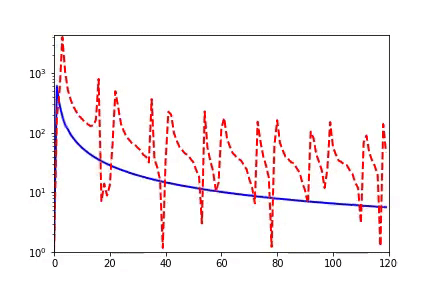
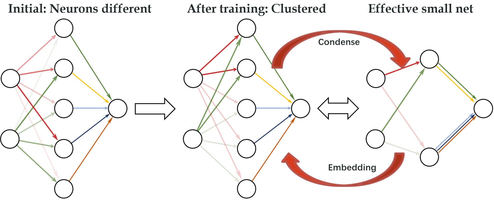

# DNN simple experiments

This code repository comprises a series of fundamental Deep Neural Network (DNN) experiments designed to assist you in comprehending and mastering the basic concepts of deep learning. Additionally, we have also verified two crucial phenomena: the Frequency Principle and the Condensation Phenomenon.

## Frinciple Principle

DNNs often fit target functions from low to high frequencies.  

The first figure shows the evolution of the function in spatial domain, the red line is the target function, and the blue line is the DNN output. *Ordinate vs. Abscissa : y vs. x*. 

The second figure shows the evolution of the function in Fourier domain, the red line is the FFT of the target function, and the blue line is the FFT of DNN output. *Ordinate vs. Abscissa: amplitude vs. frequency*. 

<!--  -->

1. **DNN 1D**
    - [Brief: One-Dimensional Regression Problems](./frequency_principle/fprinciple_brief.ipynb)

    - [Detailed: One-Dimensional Regression Problems](./frequency_principle/fprinciple.ipynb)

2. **DNN nD**
    - [High-Dimensional Classification Problems](./frequency_principle/f-principle_nd.ipynb)

### Related papers

[1] Zhi-Qin John Xu* , Yaoyu Zhang, and Yanyang Xiao, Training behavior of deep neural network in frequency domain, arXiv preprint: 1807.01251, (2018), 26th International Conference on Neural Information Processing (ICONIP 2019). [pdf](https://ins.sjtu.edu.cn/people/xuzhiqin/pub/training_behavior_ICONIP2019_XZX.pdf) and [web](https://link.springer.com/chapter/10.1007/978-3-030-36708-4_22)

[2] Zhi-Qin John Xu* , Yaoyu Zhang, Tao Luo, Yanyang Xiao, Zheng Ma, Frequency Principle: Fourier Analysis Sheds Light on Deep Neural Networks, arXiv preprint: 1901.06523, Communications in Computational Physics (CiCP). [pdf](https://ins.sjtu.edu.cn/people/xuzhiqin/pub/shedlightCiCP.pdf) and in [web](https://www.global-sci.org/intro/article_detail/cicp/18395.html), some code is in [github](https://github.com/xuzhiqin1990/F-Principle) 

[3] Zhi-Qin John Xu*, Yaoyu Zhang, Tao Luo, Overview frequency principle/spectral bias in deep learning. arxiv 2201.07395 (2022) . [pdf](https://ins.sjtu.edu.cn/people/xuzhiqin/pub/fpoverview2201.07395.pdf), and in [arxiv](https://arxiv.org/abs/2201.07395).

For more details, refer to [Zhi-Qin John Xu's homepage](https://ins.sjtu.edu.cn/people/xuzhiqin/pub.html)

## Condensation

The above picture is the illstration of the condensation. 

### Related Papers

[1] Tao Luo#, Zhi-Qin John Xu #, Zheng Ma, Yaoyu Zhang*, Phase diagram for two-layer ReLU neural networks at infinite-width limit, arxiv 2007.07497 (2020), Journal of Machine Learning Research (2021) [pdf](https://ins.sjtu.edu.cn/people/xuzhiqin/pub/phasediagram2020.pdf), and in [arxiv](https://arxiv.org/abs/2007.07497). 

[2] Hanxu Zhou, Qixuan Zhou, Tao Luo, Yaoyu Zhang*, Zhi-Qin John Xu*, Towards Understanding the Condensation of Neural Networks at Initial Training. arxiv 2105.11686 (2021) [pdf](https://ins.sjtu.edu.cn/people/xuzhiqin/pub/initial2105.11686.pdf), and in [arxiv](https://arxiv.org/abs/2105.11686), see slides and [video talk in Chinese](https://www.bilibili.com/video/BV1tb4y1d7CZ/?spm_id_from%253D333.999.0.0), NeurIPS2022. 

For more details, see [xuzhiqin condense](https://ins.sjtu.edu.cn/people/xuzhiqin/pubcondense.html)

## Contact Us

If you have any questions or suggestions, you can reach us via email at:

Zhi-Qin John Xu : xuzhiqin@sjtu.edu.cn

Zhongwang Zhang : 0123zzw666@sjtu.edu.cn

Zhangchen Zhou : zczhou1115@sjtu.edu.cn

